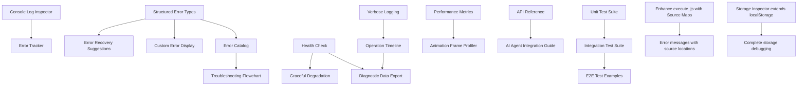

# Tauri MCP Plugin Improvement Tasks

> Generated by Conductor Analyzer on 2025-10-20
> Focus: AI Development & Debugging Improvements
> Planning Method: Auto-estimated Story Points (Fibonacci Scale)

---

## 📊 Quick Summary

| Metric | Value |
|--------|-------|
| **Total Tasks** | 47 |
| **Total Story Points** | 189 pts |
| **Average Task Size** | 4.0 pts |
| **Priority Breakdown** | P0: 8, P1: 15, P2: 16, P3: 8 |

---

## 1. MCP Tool Enhancements

### 1.1 Missing Critical Debugging Tools

- [ ] **Add Console Log Inspector Tool**

  **Story Points:** 5 ⭐
  **Priority:** P0
  **Dependencies:** None
  **Files Modified:**
  - `/Users/udi/work/moinsen/ideas/repocaster/.tauri-plugin-mcp/src/tools/console_logs.rs` (new)
  - `/Users/udi/work/moinsen/ideas/repocaster/.tauri-plugin-mcp/src/tools/mod.rs`
  - `/Users/udi/work/moinsen/ideas/repocaster/.tauri-plugin-mcp/mcp-server-ts/src/tools/console_logs.ts` (new)
  - `/Users/udi/work/moinsen/ideas/repocaster/.tauri-plugin-mcp/mcp-server-ts/src/tools/index.ts`

  **Expected Outcome:** AI agents can retrieve console.log, console.error, console.warn messages from the webview, optionally filtered by level and time range. This is critical for debugging runtime issues.

  **Complexity Factors:**
  - Need to inject console capture script into webview on startup
  - Requires event streaming from frontend to Rust backend
  - Must handle large log volumes efficiently

- [ ] **Add Network Request Inspector Tool**

  **Story Points:** 8 ⭐
  **Priority:** P0
  **Dependencies:** None
  **Files Modified:**
  - `/Users/udi/work/moinsen/ideas/repocaster/.tauri-plugin-mcp/src/tools/network_inspector.rs` (new)
  - `/Users/udi/work/moinsen/ideas/repocaster/.tauri-plugin-mcp/src/tools/mod.rs`
  - `/Users/udi/work/moinsen/ideas/repocaster/.tauri-plugin-mcp/mcp-server-ts/src/tools/network_inspector.ts` (new)
  - `/Users/udi/work/moinsen/ideas/repocaster/.tauri-plugin-mcp/mcp-server-ts/src/tools/index.ts`

  **Expected Outcome:** AI agents can inspect network requests (fetch/XHR), view request/response headers, bodies, status codes, and timing. Essential for debugging API integration issues.

  **Complexity Factors:**
  - Requires intercepting fetch/XHR at webview level
  - Need to serialize and store request/response data
  - Must handle binary data and large payloads
  - Timing measurement requires precision

- [ ] **Add Application State Dump Tool**

  **Story Points:** 8 ⭐
  **Priority:** P0
  **Dependencies:** None
  **Files Modified:**
  - `/Users/udi/work/moinsen/ideas/repocaster/.tauri-plugin-mcp/src/tools/state_dump.rs` (new)
  - `/Users/udi/work/moinsen/ideas/repocaster/.tauri-plugin-mcp/src/tools/mod.rs`
  - `/Users/udi/work/moinsen/ideas/repocaster/.tauri-plugin-mcp/mcp-server-ts/src/tools/state_dump.ts` (new)
  - `/Users/udi/work/moinsen/ideas/repocaster/.tauri-plugin-mcp/mcp-server-ts/src/tools/index.ts`

  **Expected Outcome:** AI agents can retrieve application state from common state management libraries (Zustand, Redux, Pinia, etc.) by executing introspection code in the webview context.

  **Complexity Factors:**
  - Must detect which state management library is in use
  - Different libraries have different introspection APIs
  - Need to handle circular references and non-serializable data
  - Large state trees need truncation/filtering

- [ ] **Add React/Vue DevTools Data Access Tool**

  **Story Points:** 13 ⭐
  **Priority:** P1
  **Dependencies:** None
  **Files Modified:**
  - `/Users/udi/work/moinsen/ideas/repocaster/.tauri-plugin-mcp/src/tools/devtools_bridge.rs` (new)
  - `/Users/udi/work/moinsen/ideas/repocaster/.tauri-plugin-mcp/src/tools/mod.rs`
  - `/Users/udi/work/moinsen/ideas/repocaster/.tauri-plugin-mcp/mcp-server-ts/src/tools/devtools_bridge.ts` (new)
  - `/Users/udi/work/moinsen/ideas/repocaster/.tauri-plugin-mcp/mcp-server-ts/src/tools/index.ts`

  **Expected Outcome:** AI agents can query component hierarchy, props, state, and hooks data from React/Vue DevTools protocol. This provides deep framework-specific insights.

  **Complexity Factors:**
  - Requires understanding React/Vue DevTools bridge protocol
  - Must detect framework type and version
  - Complex data structures need careful serialization
  - May need to handle both React DevTools v4 and v5

- [ ] **Add Error Boundary/Exception Tracking Tool**

  **Story Points:** 5 ⭐
  **Priority:** P0
  **Dependencies:** Console Log Inspector Tool
  **Files Modified:**
  - `/Users/udi/work/moinsen/ideas/repocaster/.tauri-plugin-mcp/src/tools/error_tracker.rs` (new)
  - `/Users/udi/work/moinsen/ideas/repocaster/.tauri-plugin-mcp/src/tools/mod.rs`
  - `/Users/udi/work/moinsen/ideas/repocaster/.tauri-plugin-mcp/mcp-server-ts/src/tools/error_tracker.ts` (new)
  - `/Users/udi/work/moinsen/ideas/repocaster/.tauri-plugin-mcp/mcp-server-ts/src/tools/index.ts`

  **Expected Outcome:** AI agents can retrieve unhandled exceptions, React error boundary catches, and promise rejections with full stack traces. Critical for understanding crash causes.

  **Complexity Factors:**
  - Need to hook into window.onerror and unhandledrejection
  - Must capture stack traces with source maps resolution
  - Should track error frequency and first occurrence time

- [ ] **Add Performance Metrics Tool**

  **Story Points:** 8 ⭐
  **Priority:** P1
  **Dependencies:** None
  **Files Modified:**
  - `/Users/udi/work/moinsen/ideas/repocaster/.tauri-plugin-mcp/src/tools/performance.rs` (new)
  - `/Users/udi/work/moinsen/ideas/repocaster/.tauri-plugin-mcp/src/tools/mod.rs`
  - `/Users/udi/work/moinsen/ideas/repocaster/.tauri-plugin-mcp/mcp-server-ts/src/tools/performance.ts` (new)
  - `/Users/udi/work/moinsen/ideas/repocaster/.tauri-plugin-mcp/mcp-server-ts/src/tools/index.ts`

  **Expected Outcome:** AI agents can retrieve Performance API metrics (navigation timing, resource timing, user timing marks/measures), memory usage, and render performance data.

  **Complexity Factors:**
  - Need to access multiple Performance APIs
  - Memory profiling requires browser-specific APIs
  - Data aggregation and formatting for AI consumption

- [ ] **Add Storage Inspector Tool (localStorage/sessionStorage/IndexedDB)**

  **Story Points:** 5 ⭐
  **Priority:** P1
  **Dependencies:** Existing local_storage tool
  **Files Modified:**
  - `/Users/udi/work/moinsen/ideas/repocaster/.tauri-plugin-mcp/src/tools/storage_inspector.rs` (new)
  - `/Users/udi/work/moinsen/ideas/repocaster/.tauri-plugin-mcp/src/tools/mod.rs`
  - `/Users/udi/work/moinsen/ideas/repocaster/.tauri-plugin-mcp/mcp-server-ts/src/tools/storage_inspector.ts` (new)
  - `/Users/udi/work/moinsen/ideas/repocaster/.tauri-plugin-mcp/mcp-server-ts/src/tools/index.ts`

  **Expected Outcome:** Extend existing localStorage tool to support sessionStorage and IndexedDB inspection. AI agents can list databases, object stores, and query data.

  **Complexity Factors:**
  - IndexedDB has async API requiring promise handling
  - Need to handle different data types and binary data
  - Large databases need pagination

- [ ] **Add Service Worker Inspector Tool**

  **Story Points:** 8 ⭐
  **Priority:** P2
  **Dependencies:** None
  **Files Modified:**
  - `/Users/udi/work/moinsen/ideas/repocaster/.tauri-plugin-mcp/src/tools/service_worker.rs` (new)
  - `/Users/udi/work/moinsen/ideas/repocaster/.tauri-plugin-mcp/src/tools/mod.rs`
  - `/Users/udi/work/moinsen/ideas/repocaster/.tauri-plugin-mcp/mcp-server-ts/src/tools/service_worker.ts` (new)
  - `/Users/udi/work/moinsen/ideas/repocaster/.tauri-plugin-mcp/mcp-server-ts/src/tools/index.ts`

  **Expected Outcome:** AI agents can inspect service worker state, check registration status, view cached resources, and trigger updates. Important for PWA debugging.

  **Complexity Factors:**
  - Service Worker API is complex and async
  - Cache API requires separate querying
  - Must handle different service worker states

### 1.2 Enhanced Existing Tool Capabilities

- [ ] **Enhance execute_js with Source Mapping Support**

  **Story Points:** 5 ⭐
  **Priority:** P1
  **Dependencies:** None
  **Files Modified:**
  - `/Users/udi/work/moinsen/ideas/repocaster/.tauri-plugin-mcp/src/tools/execute_js.rs`
  - `/Users/udi/work/moinsen/ideas/repocaster/.tauri-plugin-mcp/mcp-server-ts/src/tools/execute_js.ts`

  **Expected Outcome:** When JavaScript execution fails, error messages include original source locations (not transpiled), making debugging TypeScript/JSX easier.

  **Complexity Factors:**
  - Need to access and parse source maps
  - Error stack trace transformation
  - May require additional dependencies

- [ ] **Enhance get_dom with CSS Selector Query Support**

  **Story Points:** 3 ⭐
  **Priority:** P2
  **Dependencies:** None
  **Files Modified:**
  - `/Users/udi/work/moinsen/ideas/repocaster/.tauri-plugin-mcp/src/tools/webview.rs`
  - `/Users/udi/work/moinsen/ideas/repocaster/.tauri-plugin-mcp/mcp-server-ts/src/tools/get_dom.ts`

  **Expected Outcome:** Instead of returning full DOM, allow AI agents to query specific elements using CSS selectors and retrieve targeted subtrees.

  **Complexity Factors:**
  - Need to implement selector parsing and validation
  - Must handle multiple matches gracefully
  - Performance consideration for complex selectors

- [ ] **Enhance take_screenshot with Element-Level Capture**

  **Story Points:** 5 ⭐
  **Priority:** P2
  **Dependencies:** None
  **Files Modified:**
  - `/Users/udi/work/moinsen/ideas/repocaster/.tauri-plugin-mcp/src/tools/take_screenshot.rs`
  - `/Users/udi/work/moinsen/ideas/repocaster/.tauri-plugin-mcp/src/platform/macos.rs`
  - `/Users/udi/work/moinsen/ideas/repocaster/.tauri-plugin-mcp/src/platform/windows.rs`
  - `/Users/udi/work/moinsen/ideas/repocaster/.tauri-plugin-mcp/mcp-server-ts/src/tools/take_screenshot.ts`

  **Expected Outcome:** AI agents can capture screenshots of specific DOM elements (by selector) instead of entire window, useful for focused debugging.

  **Complexity Factors:**
  - Requires getting element bounding box
  - Platform-specific coordinate translation
  - Must handle elements outside viewport

- [ ] **Add Batch Operations Support to Window Manager**

  **Story Points:** 3 ⭐
  **Priority:** P3
  **Dependencies:** None
  **Files Modified:**
  - `/Users/udi/work/moinsen/ideas/repocaster/.tauri-plugin-mcp/src/tools/window_manager.rs`
  - `/Users/udi/work/moinsen/ideas/repocaster/.tauri-plugin-mcp/mcp-server-ts/src/tools/manage_window.ts`

  **Expected Outcome:** AI agents can execute multiple window operations in a single call, improving efficiency for complex UI testing scenarios.

  **Complexity Factors:**
  - Need to handle operation ordering and dependencies
  - Error handling for partial failures
  - Transaction-like rollback capability

- [ ] **Enhance get_element_position with Computed Styles Retrieval**

  **Story Points:** 3 ⭐
  **Priority:** P2
  **Dependencies:** None
  **Files Modified:**
  - `/Users/udi/work/moinsen/ideas/repocaster/.tauri-plugin-mcp/src/tools/webview.rs`
  - `/Users/udi/work/moinsen/ideas/repocaster/.tauri-plugin-mcp/mcp-server-ts/src/tools/get_element_position.ts`

  **Expected Outcome:** When finding elements, also return computed CSS properties (visibility, display, z-index, etc.) to help AI agents understand why elements might not be interactable.

  **Complexity Factors:**
  - getComputedStyle returns many properties
  - Need to filter to most relevant properties
  - Serialization of CSS values

### 1.3 Advanced Debugging Capabilities

- [ ] **Add WebSocket Connection Inspector**

  **Story Points:** 8 ⭐
  **Priority:** P2
  **Dependencies:** None
  **Files Modified:**
  - `/Users/udi/work/moinsen/ideas/repocaster/.tauri-plugin-mcp/src/tools/websocket_inspector.rs` (new)
  - `/Users/udi/work/moinsen/ideas/repocaster/.tauri-plugin-mcp/src/tools/mod.rs`
  - `/Users/udi/work/moinsen/ideas/repocaster/.tauri-plugin-mcp/mcp-server-ts/src/tools/websocket_inspector.ts` (new)
  - `/Users/udi/work/moinsen/ideas/repocaster/.tauri-plugin-mcp/mcp-server-ts/src/tools/index.ts`

  **Expected Outcome:** AI agents can monitor WebSocket connections, view sent/received messages, and connection state. Critical for real-time app debugging.

  **Complexity Factors:**
  - Need to proxy/wrap WebSocket constructor
  - Message buffering and storage
  - Binary message handling

- [ ] **Add Animation Frame Profiler**

  **Story Points:** 5 ⭐
  **Priority:** P3
  **Dependencies:** Performance Metrics Tool
  **Files Modified:**
  - `/Users/udi/work/moinsen/ideas/repocaster/.tauri-plugin-mcp/src/tools/animation_profiler.rs` (new)
  - `/Users/udi/work/moinsen/ideas/repocaster/.tauri-plugin-mcp/src/tools/mod.rs`
  - `/Users/udi/work/moinsen/ideas/repocaster/.tauri-plugin-mcp/mcp-server-ts/src/tools/animation_profiler.ts` (new)
  - `/Users/udi/work/moinsen/ideas/repocaster/.tauri-plugin-mcp/mcp-server-ts/src/tools/index.ts`

  **Expected Outcome:** AI agents can profile render loops, detect frame drops, and identify performance bottlenecks in animations.

  **Complexity Factors:**
  - Requires requestAnimationFrame hooking
  - Frame timing calculations
  - Data aggregation over time windows

- [ ] **Add Clipboard Operations Tool**

  **Story Points:** 3 ⭐
  **Priority:** P3
  **Dependencies:** None
  **Files Modified:**
  - `/Users/udi/work/moinsen/ideas/repocaster/.tauri-plugin-mcp/src/tools/clipboard.rs` (new)
  - `/Users/udi/work/moinsen/ideas/repocaster/.tauri-plugin-mcp/src/tools/mod.rs`
  - `/Users/udi/work/moinsen/ideas/repocaster/.tauri-plugin-mcp/mcp-server-ts/src/tools/clipboard.ts` (new)
  - `/Users/udi/work/moinsen/ideas/repocaster/.tauri-plugin-mcp/mcp-server-ts/src/tools/index.ts`

  **Expected Outcome:** AI agents can read from and write to system clipboard, useful for testing copy/paste functionality.

  **Complexity Factors:**
  - Platform-specific clipboard APIs
  - Multiple data formats (text, HTML, images)
  - Permission handling

---

## 2. Error Handling & Diagnostics

### 2.1 Error Context Improvements

- [ ] **Add Structured Error Types with Context**

  **Story Points:** 5 ⭐
  **Priority:** P0
  **Dependencies:** None
  **Files Modified:**
  - `/Users/udi/work/moinsen/ideas/repocaster/.tauri-plugin-mcp/src/error.rs`

  **Expected Outcome:** Error enum extended with more specific variants that carry contextual data (window_label, operation attempted, system state), making errors more actionable for AI agents.

  **Complexity Factors:**
  - Need to refactor all error creation sites
  - Backward compatibility considerations
  - Additional error variants design

- [ ] **Enhance Socket Error Messages with Troubleshooting Hints**

  **Story Points:** 3 ⭐
  **Priority:** P1
  **Dependencies:** None
  **Files Modified:**
  - `/Users/udi/work/moinsen/ideas/repocaster/.tauri-plugin-mcp/src/socket_server.rs`
  - `/Users/udi/work/moinsen/ideas/repocaster/.tauri-plugin-mcp/mcp-server-ts/src/tools/client.ts`

  **Expected Outcome:** Connection failures include specific suggestions (check if app is running, verify port number, check firewall, etc.) rather than generic error messages.

  **Complexity Factors:**
  - Need to detect different error scenarios
  - Platform-specific troubleshooting steps
  - Maintaining accuracy of suggestions

- [ ] **Add Validation Layer for Tool Parameters**

  **Story Points:** 5 ⭐
  **Priority:** P1
  **Dependencies:** None
  **Files Modified:**
  - `/Users/udi/work/moinsen/ideas/repocaster/.tauri-plugin-mcp/src/tools/mod.rs`
  - All tool files in `/Users/udi/work/moinsen/ideas/repocaster/.tauri-plugin-mcp/src/tools/`

  **Expected Outcome:** Tool parameters are validated before execution with clear error messages explaining what's wrong and what's expected. Prevents cryptic deserialization errors.

  **Complexity Factors:**
  - Need validation logic for each parameter type
  - Custom validation rules per tool
  - User-friendly error message formatting

- [ ] **Implement Error Recovery Suggestions System**

  **Story Points:** 8 ⭐
  **Priority:** P1
  **Dependencies:** Structured Error Types
  **Files Modified:**
  - `/Users/udi/work/moinsen/ideas/repocaster/.tauri-plugin-mcp/src/error.rs`
  - `/Users/udi/work/moinsen/ideas/repocaster/.tauri-plugin-mcp/src/socket_server.rs`

  **Expected Outcome:** Errors include "next_steps" field with array of suggested actions AI agents can take to resolve the issue.

  **Complexity Factors:**
  - Knowledge base of error-to-solution mapping
  - Context-aware suggestion generation
  - Testing suggestion effectiveness

### 2.2 Diagnostic Information Enhancement

- [ ] **Add Health Check Endpoint**

  **Story Points:** 3 ⭐
  **Priority:** P0
  **Dependencies:** None
  **Files Modified:**
  - `/Users/udi/work/moinsen/ideas/repocaster/.tauri-plugin-mcp/src/tools/health_check.rs` (new)
  - `/Users/udi/work/moinsen/ideas/repocaster/.tauri-plugin-mcp/src/tools/mod.rs`
  - `/Users/udi/work/moinsen/ideas/repocaster/.tauri-plugin-mcp/mcp-server-ts/src/tools/health_check.ts` (new)

  **Expected Outcome:** AI agents can query plugin health status, version, capabilities, and system requirements before attempting operations.

  **Complexity Factors:**
  - Need to gather system information
  - Version compatibility checking
  - Capability detection (what features are available)

- [ ] **Add Verbose Logging Mode with AI-Friendly Formatting**

  **Story Points:** 5 ⭐
  **Priority:** P2
  **Dependencies:** None
  **Files Modified:**
  - `/Users/udi/work/moinsen/ideas/repocaster/.tauri-plugin-mcp/src/socket_server.rs`
  - `/Users/udi/work/moinsen/ideas/repocaster/.tauri-plugin-mcp/src/tools/mod.rs`
  - All tool implementation files

  **Expected Outcome:** When verbose mode is enabled, log messages are structured JSON with operation lifecycle (start, progress, end), timing, and outcomes. AI agents can request and parse these logs.

  **Complexity Factors:**
  - Need structured logging library integration
  - Log level management
  - Performance impact mitigation

- [ ] **Add Operation Timeline Tracking**

  **Story Points:** 8 ⭐
  **Priority:** P2
  **Dependencies:** Verbose Logging Mode
  **Files Modified:**
  - `/Users/udi/work/moinsen/ideas/repocaster/.tauri-plugin-mcp/src/tools/timeline.rs` (new)
  - `/Users/udi/work/moinsen/ideas/repocaster/.tauri-plugin-mcp/src/tools/mod.rs`
  - `/Users/udi/work/moinsen/ideas/repocaster/.tauri-plugin-mcp/mcp-server-ts/src/tools/timeline.ts` (new)

  **Expected Outcome:** AI agents can retrieve a timeline of all operations performed (screenshots, JS execution, clicks, etc.) with timestamps, durations, and outcomes. Useful for understanding test failures.

  **Complexity Factors:**
  - Need circular buffer for event storage
  - Event correlation and grouping
  - Memory management for long-running sessions

- [ ] **Implement Diagnostic Data Export**

  **Story Points:** 5 ⭐
  **Priority:** P3
  **Dependencies:** Operation Timeline, Health Check
  **Files Modified:**
  - `/Users/udi/work/moinsen/ideas/repocaster/.tauri-plugin-mcp/src/tools/diagnostics.rs` (new)
  - `/Users/udi/work/moinsen/ideas/repocaster/.tauri-plugin-mcp/src/tools/mod.rs`
  - `/Users/udi/work/moinsen/ideas/repocaster/.tauri-plugin-mcp/mcp-server-ts/src/tools/diagnostics.ts` (new)

  **Expected Outcome:** AI agents can request a comprehensive diagnostic bundle (logs, screenshots, DOM snapshots, state dumps) for post-mortem analysis or bug reports.

  **Complexity Factors:**
  - Aggregating data from multiple sources
  - Compression and size management
  - Privacy-sensitive data filtering

---

## 3. State Visibility & Inspection

### 3.1 Application State Inspection

- [ ] **Add Window State Query Tool**

  **Story Points:** 3 ⭐
  **Priority:** P1
  **Dependencies:** None
  **Files Modified:**
  - `/Users/udi/work/moinsen/ideas/repocaster/.tauri-plugin-mcp/src/tools/window_state.rs` (new)
  - `/Users/udi/work/moinsen/ideas/repocaster/.tauri-plugin-mcp/src/tools/mod.rs`
  - `/Users/udi/work/moinsen/ideas/repocaster/.tauri-plugin-mcp/mcp-server-ts/src/tools/window_state.ts` (new)

  **Expected Outcome:** AI agents can query all window properties (title, URL, dimensions, position, visibility, focus, fullscreen state) without modifying anything.

  **Complexity Factors:**
  - Multiple Tauri APIs to call
  - Aggregating data from different sources
  - Handling windows that no longer exist

- [ ] **Add Webview Metadata Inspector**

  **Story Points:** 3 ⭐
  **Priority:** P2
  **Dependencies:** None
  **Files Modified:**
  - `/Users/udi/work/moinsen/ideas/repocaster/.tauri-plugin-mcp/src/tools/webview_metadata.rs` (new)
  - `/Users/udi/work/moinsen/ideas/repocaster/.tauri-plugin-mcp/src/tools/mod.rs`
  - `/Users/udi/work/moinsen/ideas/repocaster/.tauri-plugin-mcp/mcp-server-ts/src/tools/webview_metadata.ts` (new)

  **Expected Outcome:** AI agents can retrieve webview engine version, user agent, loaded URL, navigation history, and other metadata.

  **Complexity Factors:**
  - Platform differences in available metadata
  - Some info may require JS execution in webview
  - Privacy considerations for history

- [ ] **Add Plugin Registry Inspector**

  **Story Points:** 5 ⭐
  **Priority:** P2
  **Dependencies:** None
  **Files Modified:**
  - `/Users/udi/work/moinsen/ideas/repocaster/.tauri-plugin-mcp/src/tools/plugin_registry.rs` (new)
  - `/Users/udi/work/moinsen/ideas/repocaster/.tauri-plugin-mcp/src/tools/mod.rs`
  - `/Users/udi/work/moinsen/ideas/repocaster/.tauri-plugin-mcp/mcp-server-ts/src/tools/plugin_registry.ts` (new)

  **Expected Outcome:** AI agents can list all loaded Tauri plugins, their versions, and capabilities. Helps understand what functionality is available.

  **Complexity Factors:**
  - Accessing Tauri's plugin registry
  - Capability introspection
  - Version compatibility checking

### 3.2 Frontend State Inspection

- [ ] **Add Global Variable Inspector**

  **Story Points:** 3 ⭐
  **Priority:** P1
  **Dependencies:** None
  **Files Modified:**
  - `/Users/udi/work/moinsen/ideas/repocaster/.tauri-plugin-mcp/src/tools/global_vars.rs` (new)
  - `/Users/udi/work/moinsen/ideas/repocaster/.tauri-plugin-mcp/src/tools/mod.rs`
  - `/Users/udi/work/moinsen/ideas/repocaster/.tauri-plugin-mcp/mcp-server-ts/src/tools/global_vars.ts` (new)

  **Expected Outcome:** AI agents can list and inspect global variables (window.* properties), useful for understanding exposed APIs and debugging configuration issues.

  **Complexity Factors:**
  - Large number of global properties
  - Need filtering to show relevant items
  - Handling non-serializable properties

- [ ] **Add Event Listener Inspector**

  **Story Points:** 8 ⭐
  **Priority:** P2
  **Dependencies:** None
  **Files Modified:**
  - `/Users/udi/work/moinsen/ideas/repocaster/.tauri-plugin-mcp/src/tools/event_listeners.rs` (new)
  - `/Users/udi/work/moinsen/ideas/repocaster/.tauri-plugin-mcp/src/tools/mod.rs`
  - `/Users/udi/work/moinsen/ideas/repocaster/.tauri-plugin-mcp/mcp-server-ts/src/tools/event_listeners.ts` (new)

  **Expected Outcome:** AI agents can see what event listeners are attached to DOM elements, window, and document. Helps debug event handling issues.

  **Complexity Factors:**
  - No native API to enumerate listeners
  - Must monkey-patch addEventListener
  - Need to track listener additions and removals
  - Memory leak detection

- [ ] **Add Timer Inspector (setTimeout/setInterval)**

  **Story Points:** 5 ⭐
  **Priority:** P3
  **Dependencies:** None
  **Files Modified:**
  - `/Users/udi/work/moinsen/ideas/repocaster/.tauri-plugin-mcp/src/tools/timer_inspector.rs` (new)
  - `/Users/udi/work/moinsen/ideas/repocaster/.tauri-plugin-mcp/src/tools/mod.rs`
  - `/Users/udi/work/moinsen/ideas/repocaster/.tauri-plugin-mcp/mcp-server-ts/src/tools/timer_inspector.ts` (new)

  **Expected Outcome:** AI agents can list active timers, their delays, repeat status, and creation stack traces. Helps debug timing-related issues and memory leaks.

  **Complexity Factors:**
  - Need to wrap setTimeout/setInterval
  - Timer ID tracking and lifecycle management
  - Stack trace capture for timer origin

---

## 4. Developer Experience

### 4.1 Testing Infrastructure

- [ ] **Create Comprehensive Unit Test Suite for Rust Tools**

  **Story Points:** 13 ⭐
  **Priority:** P0
  **Dependencies:** None
  **Files Modified:**
  - `/Users/udi/work/moinsen/ideas/repocaster/.tauri-plugin-mcp/src/tools/tests/` (new directory)
  - All tool files with `#[cfg(test)]` modules

  **Expected Outcome:** Each Rust tool has unit tests covering happy path, error cases, edge cases. CI/CD can run tests automatically.

  **Complexity Factors:**
  - Need to mock Tauri AppHandle and window APIs
  - Async testing complexity
  - Test fixture setup
  - ~15 tools to cover

- [ ] **Create Integration Test Suite with Mock Tauri App**

  **Story Points:** 13 ⭐
  **Priority:** P1
  **Dependencies:** Unit Test Suite
  **Files Modified:**
  - `/Users/udi/work/moinsen/ideas/repocaster/.tauri-plugin-mcp/tests/` (new directory)
  - `/Users/udi/work/moinsen/ideas/repocaster/.tauri-plugin-mcp/tests/mock_app/` (new)

  **Expected Outcome:** End-to-end tests that start MCP server, connect client, and verify all tools work correctly together.

  **Complexity Factors:**
  - Creating realistic mock Tauri application
  - Socket connection test setup
  - Test isolation and cleanup
  - Multi-platform test compatibility

- [ ] **Add TypeScript Unit Tests for MCP Server Tools**

  **Story Points:** 8 ⭐
  **Priority:** P1
  **Dependencies:** None
  **Files Modified:**
  - `/Users/udi/work/moinsen/ideas/repocaster/.tauri-plugin-mcp/mcp-server-ts/tests/` (new directory)
  - `/Users/udi/work/moinsen/ideas/repocaster/.tauri-plugin-mcp/mcp-server-ts/package.json`

  **Expected Outcome:** TypeScript tool implementations have unit tests using Jest or Vitest, covering parameter validation, error handling, and response formatting.

  **Complexity Factors:**
  - Mock socket client for testing
  - Test framework setup
  - ~10 tool files to cover

- [ ] **Create E2E Test Examples for Common Scenarios**

  **Story Points:** 8 ⭐
  **Priority:** P2
  **Dependencies:** Integration Test Suite
  **Files Modified:**
  - `/Users/udi/work/moinsen/ideas/repocaster/.tauri-plugin-mcp/examples/` (new directory)

  **Expected Outcome:** Example test scenarios (taking screenshots, debugging form submission, inspecting state changes) that demonstrate how AI agents should use the plugin.

  **Complexity Factors:**
  - Creating realistic test scenarios
  - Documentation and explanation
  - Keeping examples up-to-date with API changes

### 4.2 Documentation Improvements

- [ ] **Create Comprehensive API Reference Documentation**

  **Story Points:** 8 ⭐
  **Priority:** P1
  **Dependencies:** None
  **Files Modified:**
  - `/Users/udi/work/moinsen/ideas/repocaster/.tauri-plugin-mcp/docs/api/` (new directory)
  - `/Users/udi/work/moinsen/ideas/repocaster/.tauri-plugin-mcp/README.md`

  **Expected Outcome:** Complete API docs for all tools with parameters, return types, error conditions, examples. Generated from code comments using rustdoc and TSDoc.

  **Complexity Factors:**
  - Need to add comprehensive doc comments to all code
  - Documentation generator setup
  - Hosting documentation website

- [ ] **Create AI Agent Integration Guide**

  **Story Points:** 5 ⭐
  **Priority:** P0
  **Dependencies:** API Reference
  **Files Modified:**
  - `/Users/udi/work/moinsen/ideas/repocaster/.tauri-plugin-mcp/docs/AI_AGENT_GUIDE.md` (new)

  **Expected Outcome:** Step-by-step guide explaining how AI agents should use the plugin for debugging, including common patterns, troubleshooting steps, and best practices.

  **Complexity Factors:**
  - Understanding AI agent capabilities and limitations
  - Creating clear, actionable guidance
  - Example scenarios and code snippets

- [ ] **Add Error Catalog with Resolution Steps**

  **Story Points:** 5 ⭐
  **Priority:** P1
  **Dependencies:** Structured Error Types
  **Files Modified:**
  - `/Users/udi/work/moinsen/ideas/repocaster/.tauri-plugin-mcp/docs/ERROR_CATALOG.md` (new)

  **Expected Outcome:** Comprehensive list of all error types, what causes them, and how to resolve them. Searchable by error code or message.

  **Complexity Factors:**
  - Cataloging all error scenarios
  - Writing resolution steps
  - Keeping catalog synchronized with code

- [ ] **Create Troubleshooting Flowchart**

  **Story Points:** 3 ⭐
  **Priority:** P2
  **Dependencies:** Error Catalog
  **Files Modified:**
  - `/Users/udi/work/moinsen/ideas/repocaster/.tauri-plugin-mcp/docs/TROUBLESHOOTING.md` (new)

  **Expected Outcome:** Visual flowchart and decision tree for diagnosing common issues (connection failures, tool errors, performance problems).

  **Complexity Factors:**
  - Creating effective diagnostic flowchart
  - Covering common scenarios
  - Making it AI-parseable (Mermaid format)

### 4.3 Development Workflow

- [ ] **Add Hot Reload Support for MCP Server Development**

  **Story Points:** 5 ⭐
  **Priority:** P2
  **Dependencies:** None
  **Files Modified:**
  - `/Users/udi/work/moinsen/ideas/repocaster/.tauri-plugin-mcp/mcp-server-ts/package.json`
  - `/Users/udi/work/moinsen/ideas/repocaster/.tauri-plugin-mcp/mcp-server-ts/dev-server.ts` (new)

  **Expected Outcome:** MCP server TypeScript code can be modified and automatically reloaded without restarting the entire development environment.

  **Complexity Factors:**
  - Watch mode setup with nodemon or similar
  - Socket reconnection handling
  - Preserving connection state

- [ ] **Create Debug Configuration for VS Code**

  **Story Points:** 3 ⭐
  **Priority:** P3
  **Dependencies:** None
  **Files Modified:**
  - `/Users/udi/work/moinsen/ideas/repocaster/.tauri-plugin-mcp/.vscode/launch.json` (new)
  - `/Users/udi/work/moinsen/ideas/repocaster/.tauri-plugin-mcp/.vscode/tasks.json` (new)

  **Expected Outcome:** One-click debugging of both Rust and TypeScript code from VS Code with breakpoints, variable inspection.

  **Complexity Factors:**
  - Configuration for both languages
  - Task dependencies for building
  - Platform-specific considerations

- [ ] **Add Performance Benchmarks for Critical Operations**

  **Story Points:** 8 ⭐
  **Priority:** P3
  **Dependencies:** None
  **Files Modified:**
  - `/Users/udi/work/moinsen/ideas/repocaster/.tauri-plugin-mcp/benches/` (new directory)
  - `/Users/udi/work/moinsen/ideas/repocaster/.tauri-plugin-mcp/Cargo.toml`

  **Expected Outcome:** Benchmark suite using criterion.rs to measure performance of screenshot capture, DOM retrieval, JS execution, etc. CI tracks performance regression.

  **Complexity Factors:**
  - Realistic benchmark scenarios
  - Consistent measurement environment
  - Baseline establishment

---

## 5. Code Architecture & Quality

### 5.1 Code Organization

- [ ] **Refactor Tool Handler Registration to Use Macro**

  **Story Points:** 5 ⭐
  **Priority:** P2
  **Dependencies:** None
  **Files Modified:**
  - `/Users/udi/work/moinsen/ideas/repocaster/.tauri-plugin-mcp/src/tools/mod.rs`

  **Expected Outcome:** Replace manual command registration with declarative macro that reduces boilerplate and ensures consistency.

  **Complexity Factors:**
  - Macro design and implementation
  - Backward compatibility
  - Error handling in macro expansion

- [ ] **Extract Common Response Patterns to Shared Utilities**

  **Story Points:** 3 ⭐
  **Priority:** P2
  **Dependencies:** None
  **Files Modified:**
  - `/Users/udi/work/moinsen/ideas/repocaster/.tauri-plugin-mcp/src/tools/response_utils.rs` (new)
  - All tool implementation files

  **Expected Outcome:** Common response building patterns (success with data, error with message, partial success) are extracted to reusable functions.

  **Complexity Factors:**
  - Identifying all response patterns
  - Ensuring type safety with generics
  - Refactoring all existing uses

- [ ] **Standardize Parameter Validation Across Tools**

  **Story Points:** 5 ⭐
  **Priority:** P2
  **Dependencies:** None
  **Files Modified:**
  - `/Users/udi/work/moinsen/ideas/repocaster/.tauri-plugin-mcp/src/validation/` (new directory)
  - All tool implementation files

  **Expected Outcome:** Consistent validation logic using a validation framework (e.g., validator crate) with standard error messages.

  **Complexity Factors:**
  - Choosing or building validation framework
  - Migrating existing validation logic
  - Custom validators for domain-specific rules

- [ ] **Implement Builder Pattern for Complex Tool Requests**

  **Story Points:** 8 ⭐
  **Priority:** P3
  **Dependencies:** None
  **Files Modified:**
  - `/Users/udi/work/moinsen/ideas/repocaster/.tauri-plugin-mcp/src/models.rs`
  - Tool files with complex parameters

  **Expected Outcome:** Complex requests (screenshot with many options, performance profiling with filters) use builder pattern for better ergonomics.

  **Complexity Factors:**
  - Builder implementation for each complex type
  - Backward compatibility with existing API
  - TypeScript binding generation

### 5.2 Error Handling Consistency

- [ ] **Standardize Error Propagation Using anyhow Context**

  **Story Points:** 5 ⭐
  **Priority:** P1
  **Dependencies:** None
  **Files Modified:**
  - All Rust source files using error handling

  **Expected Outcome:** All error propagation uses `.context()` or `.with_context()` to add helpful context at each layer, making error chains informative.

  **Complexity Factors:**
  - Need to audit all error handling code
  - Deciding what context to add at each layer
  - Avoiding redundant context

- [ ] **Implement Custom Error Display for AI Consumption**

  **Story Points:** 5 ⭐
  **Priority:** P1
  **Dependencies:** Structured Error Types
  **Files Modified:**
  - `/Users/udi/work/moinsen/ideas/repocaster/.tauri-plugin-mcp/src/error.rs`

  **Expected Outcome:** Error Display impl formats errors as structured JSON (not just strings) with fields like error_code, message, context, suggestions.

  **Complexity Factors:**
  - Custom Display implementation
  - JSON serialization of error chain
  - Maintaining human-readable format

- [ ] **Add Error Recovery Strategies**

  **Story Points:** 8 ⭐
  **Priority:** P2
  **Dependencies:** None
  **Files Modified:**
  - `/Users/udi/work/moinsen/ideas/repocaster/.tauri-plugin-mcp/src/tools/mod.rs`
  - Critical tool implementations

  **Expected Outcome:** Tools implement automatic retry logic with exponential backoff for transient failures (network timeouts, window not ready).

  **Complexity Factors:**
  - Identifying retryable vs. permanent errors
  - Retry policy configuration
  - Avoiding infinite retry loops

### 5.3 Type Safety & Validation

- [ ] **Add Compile-Time Window Label Validation**

  **Story Points:** 3 ⭐
  **Priority:** P3
  **Dependencies:** None
  **Files Modified:**
  - `/Users/udi/work/moinsen/ideas/repocaster/.tauri-plugin-mcp/src/models.rs`

  **Expected Outcome:** Window labels use newtype pattern (WindowLabel struct) instead of plain strings, catching typos at compile time.

  **Complexity Factors:**
  - Creating newtype and conversions
  - Updating all usage sites
  - Ensuring Serde compatibility

- [ ] **Add Runtime Schema Validation for Complex Payloads**

  **Story Points:** 5 ⭐
  **Priority:** P2
  **Dependencies:** None
  **Files Modified:**
  - `/Users/udi/work/moinsen/ideas/repocaster/.tauri-plugin-mcp/src/validation/schema.rs` (new)

  **Expected Outcome:** Complex tool payloads (like storage queries, selectors) are validated against JSON schemas before processing.

  **Complexity Factors:**
  - Schema definition for each tool
  - Validation library integration
  - Error message generation from schema violations

---

## 6. Performance & Reliability

### 6.1 Performance Optimization

- [ ] **Optimize Screenshot Compression for Large Images**

  **Story Points:** 5 ⭐
  **Priority:** P1
  **Dependencies:** None
  **Files Modified:**
  - `/Users/udi/work/moinsen/ideas/repocaster/.tauri-plugin-mcp/src/tools/take_screenshot.rs`
  - `/Users/udi/work/moinsen/ideas/repocaster/.tauri-plugin-mcp/src/platform/macos.rs`
  - `/Users/udi/work/moinsen/ideas/repocaster/.tauri-plugin-mcp/src/platform/windows.rs`

  **Expected Outcome:** Screenshots use optimized JPEG encoding, optional downscaling, and progressive quality reduction to meet size targets without quality loss.

  **Complexity Factors:**
  - Image processing library optimization
  - Quality vs. size tradeoff tuning
  - Platform-specific capture optimization

- [ ] **Implement Connection Pooling for Socket Server**

  **Story Points:** 8 ⭐
  **Priority:** P2
  **Dependencies:** None
  **Files Modified:**
  - `/Users/udi/work/moinsen/ideas/repocaster/.tauri-plugin-mcp/src/socket_server.rs`

  **Expected Outcome:** Socket server reuses connections and maintains a pool to reduce connection overhead for frequent operations.

  **Complexity Factors:**
  - Connection lifecycle management
  - Pool size configuration
  - Handling stale connections

- [ ] **Add Response Streaming for Large Data**

  **Story Points:** 13 ⭐
  **Priority:** P2
  **Dependencies:** None
  **Files Modified:**
  - `/Users/udi/work/moinsen/ideas/repocaster/.tauri-plugin-mcp/src/socket_server.rs`
  - Tools returning large data (get_dom, console_logs, etc.)

  **Expected Outcome:** Large responses (DOM dumps, log streams) are sent in chunks rather than all at once, reducing memory usage and perceived latency.

  **Complexity Factors:**
  - Protocol changes to support streaming
  - Client-side stream handling
  - Partial data processing
  - Backward compatibility

- [ ] **Optimize DOM Serialization**

  **Story Points:** 5 ⭐
  **Priority:** P2
  **Dependencies:** None
  **Files Modified:**
  - `/Users/udi/work/moinsen/ideas/repocaster/.tauri-plugin-mcp/src/tools/webview.rs`
  - Guest JS implementation

  **Expected Outcome:** DOM serialization uses faster algorithms (streaming serialization, selective attribute inclusion) to reduce execution time in webview.

  **Complexity Factors:**
  - JavaScript performance optimization
  - Large DOM handling
  - Incremental serialization

### 6.2 Reliability Improvements

- [ ] **Add Timeout Configuration for All Async Operations**

  **Story Points:** 3 ⭐
  **Priority:** P1
  **Dependencies:** None
  **Files Modified:**
  - `/Users/udi/work/moinsen/ideas/repocaster/.tauri-plugin-mcp/src/lib.rs`
  - All async tool implementations

  **Expected Outcome:** Every async operation has configurable timeout, preventing hung operations. Default timeouts are reasonable, and AI agents can override them.

  **Complexity Factors:**
  - Timeout middleware implementation
  - Configuration propagation
  - Graceful timeout handling

- [ ] **Implement Circuit Breaker Pattern for Window Operations**

  **Story Points:** 8 ⭐
  **Priority:** P2
  **Dependencies:** None
  **Files Modified:**
  - `/Users/udi/work/moinsen/ideas/repocaster/.tauri-plugin-mcp/src/tools/window_manager.rs`

  **Expected Outcome:** If window operations repeatedly fail, circuit breaker opens to prevent resource waste, with automatic recovery attempts.

  **Complexity Factors:**
  - Circuit breaker state machine
  - Failure threshold configuration
  - Recovery detection

- [ ] **Add Graceful Degradation for Missing Features**

  **Story Points:** 5 ⭐
  **Priority:** P2
  **Dependencies:** Health Check
  **Files Modified:**
  - All tool implementations

  **Expected Outcome:** Tools detect when required features are unavailable (older Tauri version, missing permissions) and return informative errors or fallback functionality.

  **Complexity Factors:**
  - Feature detection for each tool
  - Fallback implementation
  - Clear error messages about missing features

- [ ] **Implement Request Deduplication**

  **Story Points:** 5 ⭐
  **Priority:** P3
  **Dependencies:** None
  **Files Modified:**
  - `/Users/udi/work/moinsen/ideas/repocaster/.tauri-plugin-mcp/src/socket_server.rs`

  **Expected Outcome:** Identical requests made concurrently are deduplicated, with all requesters receiving the same response, reducing unnecessary work.

  **Complexity Factors:**
  - Request fingerprinting/hashing
  - Response broadcasting to multiple waiters
  - Cache invalidation

### 6.3 Resource Management

- [ ] **Implement Memory Limits for Buffered Data**

  **Story Points:** 5 ⭐
  **Priority:** P1
  **Dependencies:** None
  **Files Modified:**
  - `/Users/udi/work/moinsen/ideas/repocaster/.tauri-plugin-mcp/src/socket_server.rs`
  - Tools that buffer data (console_logs, network_inspector, etc.)

  **Expected Outcome:** Tools that accumulate data have configurable memory limits and use circular buffers or LRU eviction to prevent memory exhaustion.

  **Complexity Factors:**
  - Memory tracking implementation
  - Eviction policy implementation
  - Configuration for limits

- [ ] **Add Resource Cleanup Hooks**

  **Story Points:** 3 ⭐
  **Priority:** P1
  **Dependencies:** None
  **Files Modified:**
  - `/Users/udi/work/moinsen/ideas/repocaster/.tauri-plugin-mcp/src/desktop.rs`

  **Expected Outcome:** Proper cleanup of resources (event listeners, timers, connections) when plugin is unloaded or windows are closed.

  **Complexity Factors:**
  - Drop trait implementation
  - Cleanup registration system
  - Testing cleanup logic

- [ ] **Implement Rate Limiting for Tool Calls**

  **Story Points:** 5 ⭐
  **Priority:** P2
  **Dependencies:** None
  **Files Modified:**
  - `/Users/udi/work/moinsen/ideas/repocaster/.tauri-plugin-mcp/src/socket_server.rs`

  **Expected Outcome:** Rate limiting prevents AI agents from overwhelming the system with too many requests, with configurable limits per tool.

  **Complexity Factors:**
  - Rate limiting algorithm (token bucket, sliding window)
  - Per-tool and global limits
  - Error messages when rate limited

---

## 📈 Dependency Graph

---

## Priority Legend

- **P0 (Critical):** Blocking issues or critical missing capabilities for AI debugging. These are must-haves that significantly limit current AI agent effectiveness.
- **P1 (High):** Important improvements that significantly enhance AI effectiveness. These provide major value but aren't complete blockers.
- **P2 (Medium):** Useful enhancements that improve quality and usability. Nice to have for better developer/AI experience.
- **P3 (Low):** Nice-to-have improvements and polish. These add value but can be deferred.

## Execution Recommendations

### Sprint Planning (Assuming 30 points per 2-week sprint)

**Sprint 1 (P0 Focus):**
- Console Log Inspector (5 pts)
- Error Boundary Tracking (5 pts)
- Network Request Inspector (8 pts)
- Structured Error Types (5 pts)
- Health Check Endpoint (3 pts)
- AI Agent Integration Guide (5 pts)
- **Total: 31 pts**

**Sprint 2 (P0 + Critical P1):**
- Application State Dump (8 pts)
- Unit Test Suite (13 pts)
- Performance Metrics (8 pts)
- **Total: 29 pts**

**Sprint 3 (P1 High-Value Tools):**
- React/Vue DevTools Bridge (13 pts)
- Storage Inspector (5 pts)
- Enhanced execute_js with Source Maps (5 pts)
- Window State Query (3 pts)
- Timeout Configuration (3 pts)
- **Total: 29 pts**

### Quick Wins (Low-effort, High-impact)

1. Health Check Endpoint (3 pts, P0) - Immediate value
2. Window State Query (3 pts, P1) - Simple, very useful
3. Timeout Configuration (3 pts, P1) - Prevents hangs
4. Global Variable Inspector (3 pts, P1) - Easy to implement
5. Debug Configuration for VS Code (3 pts, P3) - Better DX

## Notes

### Current State Assessment

**Strengths:**
- Well-structured codebase with clean separation between Rust backend and TypeScript MCP server
- Good platform abstraction for cross-platform support (macOS, Windows, Unix)
- Solid socket communication foundation (IPC + TCP)
- Existing tools cover basic window manipulation and inspection
- No technical debt (no TODOs/FIXMEs found)
- ~3,400 lines of Rust code, well-organized

**Critical Gaps:**
1. **No console/error inspection** - AI agents are blind to runtime errors and log messages
2. **No network debugging** - Can't see what API calls are being made or failing
3. **No application state visibility** - Can't inspect React/Vue/Zustand state
4. **Limited error context** - Errors lack actionable information for debugging
5. **No test coverage** - Makes maintenance and refactoring risky
6. **Sparse documentation** - README is good but lacks comprehensive API docs

**Architecture Observations:**
- Clean error handling foundation but needs expansion
- Event-driven communication between webview and Rust via Tauri events
- Good use of async/await throughout
- Type-safe with strong Rust/TypeScript typing
- Well-factored tools in separate files

### Key Opportunities

1. **Console/Error/Network Inspection** (P0) - These three tools would immediately make the plugin 10x more valuable for AI debugging. Currently, AI agents can see visual state (DOM, screenshots) but not runtime behavior.

2. **Test Infrastructure** (P0/P1) - Critical for maintainability as the plugin grows. Unit + integration tests would enable confident refactoring and new feature development.

3. **Enhanced Error Messages** (P0/P1) - Current errors are functional but not AI-friendly. Adding context, suggestions, and troubleshooting hints would dramatically improve AI agent effectiveness.

4. **State Inspection Tools** (P1) - Application state dump and DevTools bridge would enable AI agents to understand application logic, not just UI state.

5. **Documentation** (P1) - The plugin has great functionality but needs comprehensive docs to guide AI agent usage patterns and troubleshooting.

### Technology Considerations

**Dependencies to Add:**
- `validator` crate for parameter validation
- `criterion` for benchmarking
- `mockall` or similar for mocking in tests
- `tracing` for structured logging (replace `log`)

**TypeScript:**
- Add Jest or Vitest for unit testing
- Consider adding TypeScript SDK documentation generator

**Platform Support:**
- Current focus is desktop (macOS, Windows, Linux)
- Mobile support marked as unimplemented (panic in mobile.rs)
- Cross-platform differences well-isolated in platform modules

### Risk Assessment

**Low Risk:**
- Adding new read-only inspection tools (console logs, state dump, network inspector)
- Documentation and testing improvements
- Enhanced error messages

**Medium Risk:**
- Refactoring existing code (response patterns, validation)
- Performance optimizations (streaming, compression)
- New write capabilities (clipboard, more window operations)

**High Risk:**
- Breaking API changes (would affect all AI agents using the plugin)
- Major architectural changes (e.g., moving from event-based to different pattern)
- Platform-specific features that may not work everywhere

---

**Generated**: 2025-10-20
**Total Tasks**: 47
**Total Story Points**: 189
**Analysis Type**: AI Development & Debugging Improvements
**Estimated Timeline**: ~6-7 sprints (3-4 months) for all tasks at 30 pts/sprint
**Quick Wins Available**: Yes (15 points of P0/P1 work under 3 points each)
